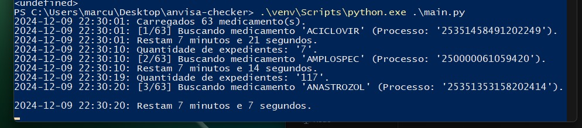

# Extrator de Expedientes da ANVISA



Este script extrai os expedientes de um processo de registro de medicamento do site da [Anvisa](https://consultas.anvisa.gov.br/#/medicamentos/).

Os dados extraídos são salvos em um arquivo CSV para posterior importação no Excel.

### Dependências:
1. [BeautifulSoup](https://beautiful-soup-4.readthedocs.io/en/latest/)
2. [Selenium](https://www.selenium.dev/)

### Instalação:
Para executar o script no Windows:
1. Instale o [Python](https://www.python.org/).
   1. Não é necessário utilizar permissões de administrador.
   2. Marque a caixa de seleção para adicionar o Python ao `PATH`.
2. Cire um [ambiente virtual](https://docs.python.org/3/library/venv.html#creating-virtual-environments) na pasta do script.
   1. Clone o repositório.
   2. Extraia o zip para uma pasta de fácil acesso.
   3. Abra o PowerShell e navegue até a pasta.
   4. Execute `python -m venv .\venv`.
3. Instale as dependências.
   1. Na pasta do script, execute `.\venv\Scripts\python.exe -m pip install bs4`.
   2. Após finalizar, execute `.\venv\Scripts\python.exe -m pip install selenium`.
4. Execute o script.
   1. Na pasta do script, execute `.\venv\Scripts\python.exe .\main.py`.

OBS.: Também é possível [ativar o ambiente virtual](https://docs.python.org/3/library/venv.html#how-venvs-work).

### Utilização:
Insira os nomes dos medicamentos e os números de protocolos no arquivo `protocolos.txt`.

Garanta que haja apenas um medicamento por linha e que eles sempre sigam o formato:
```
NOME DO MEDICAMENTO | 12345467890
```
Utilize a barra em pé para separar o número do protocolo do nome do medicamento.